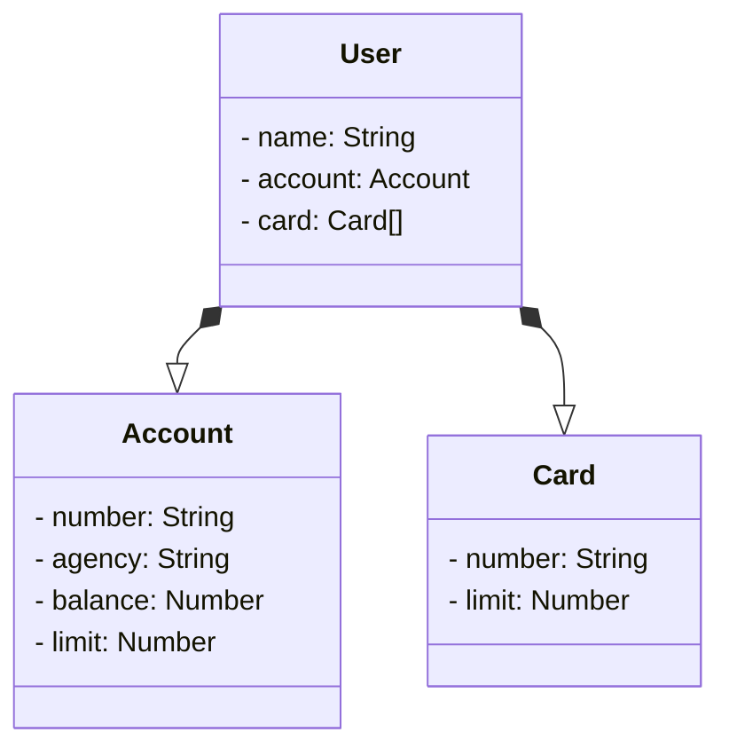

# Desafio Santander & Digital Innovation One Bootcamp - RESTful API em Java

## Descrição

Este projeto faz parte do desafio proposto pelo Bootcamp Santander & Digital Innovation One e consiste em uma RESTful API desenvolvida em Java. O projeto foi inicializado utilizando o Spring Initializer e inclui as seguintes dependências:

- **Spring Web:** Para a criação de APIs RESTful e roteamento de requisições HTTP.
- **Spring Data JPA:** Para a integração com o banco de dados e operações de persistência.
- **H2 Database:** Um banco de dados em memória que facilita o desenvolvimento e testes.
- **PostgreSQL Driver:** Para a conexão com o banco de dados PostgreSQL em ambientes de produção.

## Diagrama

